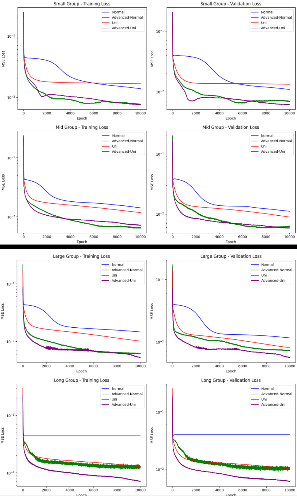

--> Uni-Neuron Network (Uni-NN) Experiment  *v^

A fun experiment introducing a new neural network idea: Uni-Neuron Network (Uni-NN)! This architecture aims to tackle the gradient vanishing and exploding problems commonly faced in deep networks by using skip-layer connections. Let's dive into this innovative approach inspired by the human brain! 🚀

-----

* What is Uni-NN?

- Normal Neural Network
- 
In a traditional neural network, each layer's activation is computed as:

a = f(weight * a_last_layer + bias)

where:

a is the activation of the current layer,

f is the activation function (e.g., ReLU),

weight * a_last_layer + bias combines the previous layer's activation with weights and biases.

- Uni-Neuron Network (Uni-NN)

Uni-NN modifies this by introducing skip-layer connections, allowing a neuron to connect not just to the previous layer but also to earlier layers:

a = f(weight * a_last_layer + weight * a_last_last_layer + ... + bias)

This means the current layer's activation aggregates contributions from all previous layers, not just the immediate predecessor.

-----

* Inspiration: 

Uni-NN is inspired by the human brain 🧠, where neurons don't connect strictly layer-by-layer. A single neuron can form connections with hundreds of others across different layers, enabling richer information flow. Uni-NN mimics this by adding skip connections, which help prevent gradient vanishing/exploding and speed up convergence, especially with advanced optimizers like Adam.

-----

* Key Findings

Gradient Stability: Uni-NN showcases strong prevention of gradient vanishing and exploding problems by allowing gradients to flow through multiple paths via skip connections.
Faster Convergence: When paired with advanced methods like Adam, Uni-NN converges faster compared to traditional NNs.
Learning Curve
Below is the learning curve for the Advanced Uni-NN at a learning rate of 0.005, demonstrating its training performance:

-----

* What's Next?

This repository contains the experiment's code, results, and detailed analysis. 

We aim to inspire, contribute, and grow—open to every idea in the AI community! 🌟

Contributions and ideas are welcome! Let's explore the potential of Uni-NN together! 😄
